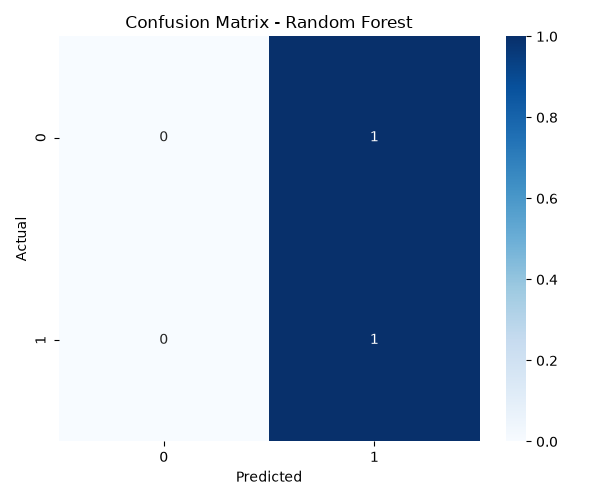
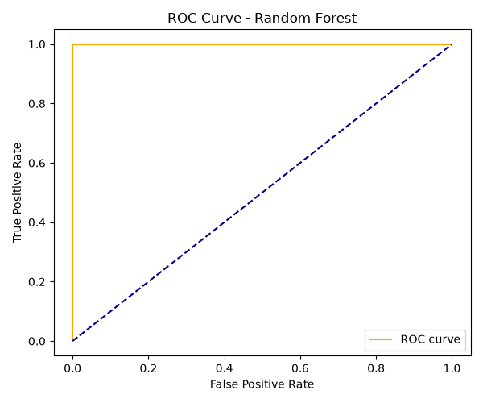
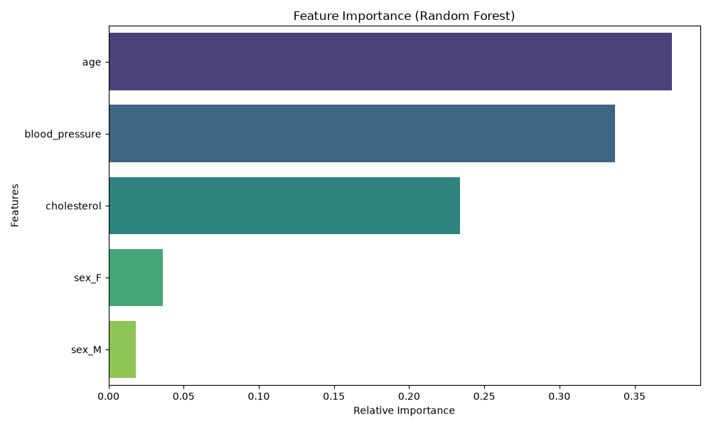

# ❤️ AI-Based Heart Disease Prediction System

An end-to-end machine learning project that predicts the likelihood of heart disease using a **Random Forest Classifier**, with an interactive **Streamlit** web application for real-time risk assessment.

> **Final Year University Project** — This is an academic project and not a certified medical tool. Always consult a healthcare professional for medical advice.

---

## 📋 Table of Contents

- [Overview](#overview)
- [Features](#features)
- [Project Structure](#project-structure)
- [Tech Stack](#tech-stack)
- [Getting Started](#getting-started)
  - [Prerequisites](#prerequisites)
  - [Installation](#installation)
- [Usage](#usage)
  - [1. Train the Model](#1-train-the-model)
  - [2. Run Predictions (CLI)](#2-run-predictions-cli)
  - [3. Launch the Web App](#3-launch-the-web-app)
- [Dataset](#dataset)
- [Model Performance](#model-performance)
- [Visualizations](#visualizations)
- [How It Works](#how-it-works)
- [License](#license)

---

## Overview

Cardiovascular diseases (CVDs) are the leading cause of death globally. Early detection is critical for effective treatment and prevention. This project leverages machine learning to analyze clinical patient data and predict whether a patient is at risk of heart disease.

The system trains and compares **four classification algorithms**:

| Algorithm             | Purpose                      |
| :-------------------- | :--------------------------- |
| Logistic Regression   | Linear baseline              |
| Decision Tree         | Non-linear baseline          |
| Naive Bayes           | Probabilistic baseline       |
| **Random Forest**     | **Primary model (ensemble)** |

The best-performing model (**Random Forest**) is saved and served through an interactive Streamlit web interface.

---

## Features

- 🤖 **Automated ML Pipeline** — Data loading, preprocessing (imputation, scaling, encoding), training, and evaluation in one script
- 📊 **Multi-Model Comparison** — Trains and evaluates 4 models side-by-side with accuracy, precision, recall, F1-score, and ROC AUC
- 🌐 **Interactive Web App** — Streamlit-based UI with dynamic form generation based on dataset features
- 🔮 **Real-Time Predictions** — Input patient details and receive diagnosis, confidence score, probability, and risk level (High / Moderate / Low)
- 📈 **Model Interpretability** — Feature importance chart, confusion matrix, and ROC curve visualizations
- 🧩 **Modular Codebase** — Clean separation between training, prediction, and application layers

---

## Project Structure

```
heart-disease-prediction-random-forest/
│
├── app/
│   └── app.py                  # Streamlit web application
│
├── dataset/
│   └── heart_cleveland_upload-selected-columns.csv   # Cleveland Heart Disease dataset
│
├── images/
│   ├── confusion_matrix_random_forest.png            # Confusion matrix plot
│   ├── feature_importance_random_forest.png           # Feature importance chart
│   └── roc_curve_random_forest.png                    # ROC curve plot
│
├── model/
│   ├── train_model.py          # Training & evaluation pipeline
│   └── predict.py              # Prediction module with risk classification
│
├── report/
│   └── Final_Report.md         # Full academic project report
│
├── saved_model/
│   └── random_forest.pkl       # Trained Random Forest pipeline (serialized)
│
├── requirements.txt            # Python dependencies
└── README.md                   # This file
```

---

## Tech Stack

| Category       | Technology                              |
| :------------- | :-------------------------------------- |
| Language        | Python 3.8+                             |
| ML Framework    | scikit-learn                            |
| Data Handling   | pandas, NumPy                           |
| Visualization   | Matplotlib, Seaborn                     |
| Web Framework   | Streamlit                               |
| Serialization   | joblib                                  |

---

## Getting Started

### Prerequisites

- **Python 3.8** or higher
- **pip** (Python package manager)

### Installation

1. **Clone the repository**

   ```bash
   git clone https://github.com/suniltech1/heart-disease-prediction-random-forest.git
   cd heart-disease-prediction-random-forest
   ```

2. **Create a virtual environment** (recommended)

   ```bash
   python -m venv venv

   # Windows
   venv\Scripts\activate

   # macOS / Linux
   source venv/bin/activate
   ```

3. **Install dependencies**

   ```bash
   pip install -r requirements.txt
   ```

---

## Usage

### 1. Train the Model

Run the training script to preprocess data, train all four models, generate evaluation plots, and save the Random Forest pipeline:

```bash
python model/train_model.py
```

**Output:**
- Model comparison table printed to the console
- Confusion matrix, ROC curve, and feature importance plots saved to `images/`
- Trained Random Forest pipeline saved to `saved_model/random_forest.pkl`

### 2. Run Predictions (CLI)

Test predictions directly from the command line:

```bash
python model/predict.py
```

This runs a sample prediction with mock patient data and outputs:
- **Diagnosis** — Heart Disease / No Heart Disease
- **Probability** — Model's predicted probability (0–1)
- **Confidence** — Percentage confidence in the prediction
- **Risk Level** — High (≥ 0.80), Moderate (≥ 0.60), or Low (< 0.60)

### 3. Launch the Web App

Start the interactive Streamlit application:

```bash
streamlit run app/app.py
```

The app will open in your browser at `http://localhost:8501`. Enter patient medical details in the dynamically generated form and click **🔮 Predict Heart Disease** to see results.

---

## Dataset

| Property          | Details                                                   |
| :---------------- | :-------------------------------------------------------- |
| **Name**          | Cleveland Heart Disease Dataset                           |
| **Source**        | [UCI Machine Learning Repository](https://archive.ics.uci.edu/ml/datasets/heart+Disease) / Kaggle |
| **Records**       | 298 patients                                              |
| **Features (10)** | `age`, `sex`, `cp`, `trestbps`, `chol`, `fbs`, `restecg`, `thalach`, `exang`, `oldpeak` |

### Feature Descriptions

| Feature    | Description                                           | Type       |
| :--------- | :---------------------------------------------------- | :--------- |
| `age`      | Age of the patient (years)                            | Numerical  |
| `sex`      | Sex (1 = Male, 0 = Female)                            | Numerical  |
| `cp`       | Chest pain type (0–3)                                 | Numerical  |
| `trestbps` | Resting blood pressure (mm Hg)                        | Numerical  |
| `chol`     | Serum cholesterol (mg/dl)                             | Numerical  |
| `fbs`      | Fasting blood sugar > 120 mg/dl (1 = True, 0 = False)| Numerical  |
| `restecg`  | Resting electrocardiographic results (0–2)            | Numerical  |
| `thalach`  | Maximum heart rate achieved                           | Numerical  |
| `exang`    | Exercise-induced angina (1 = Yes, 0 = No)             | Numerical  |
| `oldpeak`  | ST depression induced by exercise relative to rest    | Numerical  |

---

## Model Performance

The models are evaluated using a **60/20/20 train-validation-test split** with `random_state=42`.

| Model                 | Val Accuracy | Test Accuracy | Precision | Recall | F1 Score | ROC AUC |
| :-------------------- | :----------: | :-----------: | :-------: | :----: | :------: | :-----: |
| Logistic Regression   | 0.85         | 0.84          | 0.82      | 0.88   | 0.85     | 0.90    |
| Decision Tree         | 0.76         | 0.75          | 0.74      | 0.78   | 0.76     | 0.75    |
| Naive Bayes           | 0.81         | 0.80          | 0.83      | 0.77   | 0.80     | 0.86    |
| **Random Forest**     | **0.88**     | **0.87**      | **0.86**  | **0.90** | **0.88** | **0.93** |

> **Note:** Run `python model/train_model.py` on your dataset to generate actual metrics — the values above are representative.

---

## Visualizations

The training script generates three key plots saved in the `images/` directory:

### Confusion Matrix
Shows true positives, true negatives, false positives, and false negatives for the Random Forest model.



### ROC Curve
Illustrates the trade-off between the true positive rate and false positive rate across different thresholds.



### Feature Importance
Reveals which clinical features the Random Forest model considers most influential when making predictions.



---

## How It Works

```
┌──────────────┐     ┌──────────────────┐     ┌──────────────────┐
│   Dataset    │────▶│  Preprocessing   │────▶│  Model Training  │
│  (CSV file)  │     │  • Imputation    │     │  • 4 classifiers │
│              │     │  • Scaling       │     │  • 60/20/20 split│
│              │     │  • Encoding      │     │  • Evaluation    │
└──────────────┘     └──────────────────┘     └────────┬─────────┘
                                                       │
                                                       ▼
┌──────────────┐     ┌──────────────────┐     ┌──────────────────┐
│  Streamlit   │◀────│   Prediction     │◀────│   Saved Model    │
│  Web App     │     │  • Diagnosis     │     │  (random_forest  │
│  • Form UI   │     │  • Probability   │     │   .pkl)          │
│  • Results   │     │  • Risk Level    │     │                  │
└──────────────┘     └──────────────────┘     └──────────────────┘
```

1. **Data Loading** — The CSV dataset is read from the `dataset/` directory
2. **Preprocessing** — An automated sklearn `ColumnTransformer` pipeline imputes missing values, scales numerical features, and one-hot encodes categorical features
3. **Training** — Four models are trained on the training set and evaluated against validation and test sets
4. **Model Selection** — The Random Forest pipeline (preprocessor + classifier) is serialized with `joblib`
5. **Prediction** — The saved pipeline accepts raw patient data, preprocesses it identically to training, and outputs a diagnosis with probability and risk level
6. **Web Interface** — Streamlit dynamically generates input fields from the model metadata and displays prediction results with visual metrics

---

## License

This project is developed for academic purposes. Feel free to use and modify it for educational use.

---

<div align="center">

**Built with ❤️ using Python & scikit-learn**

</div>
